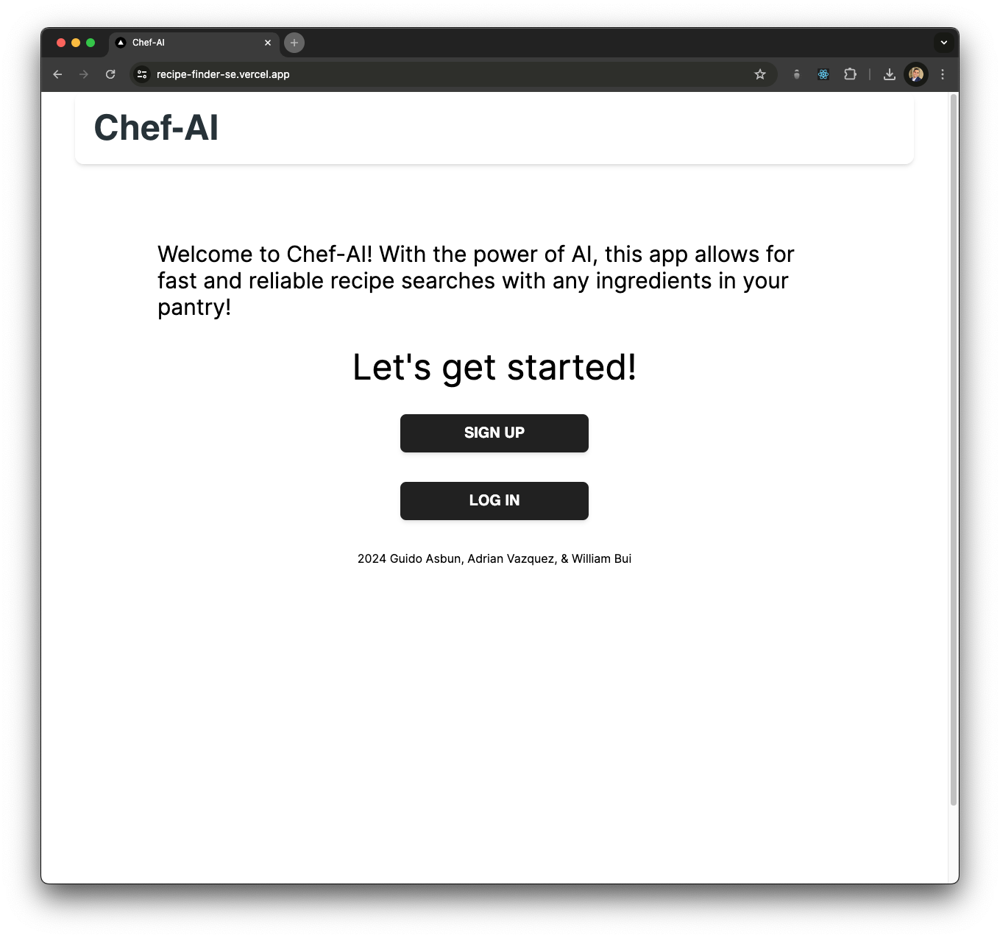
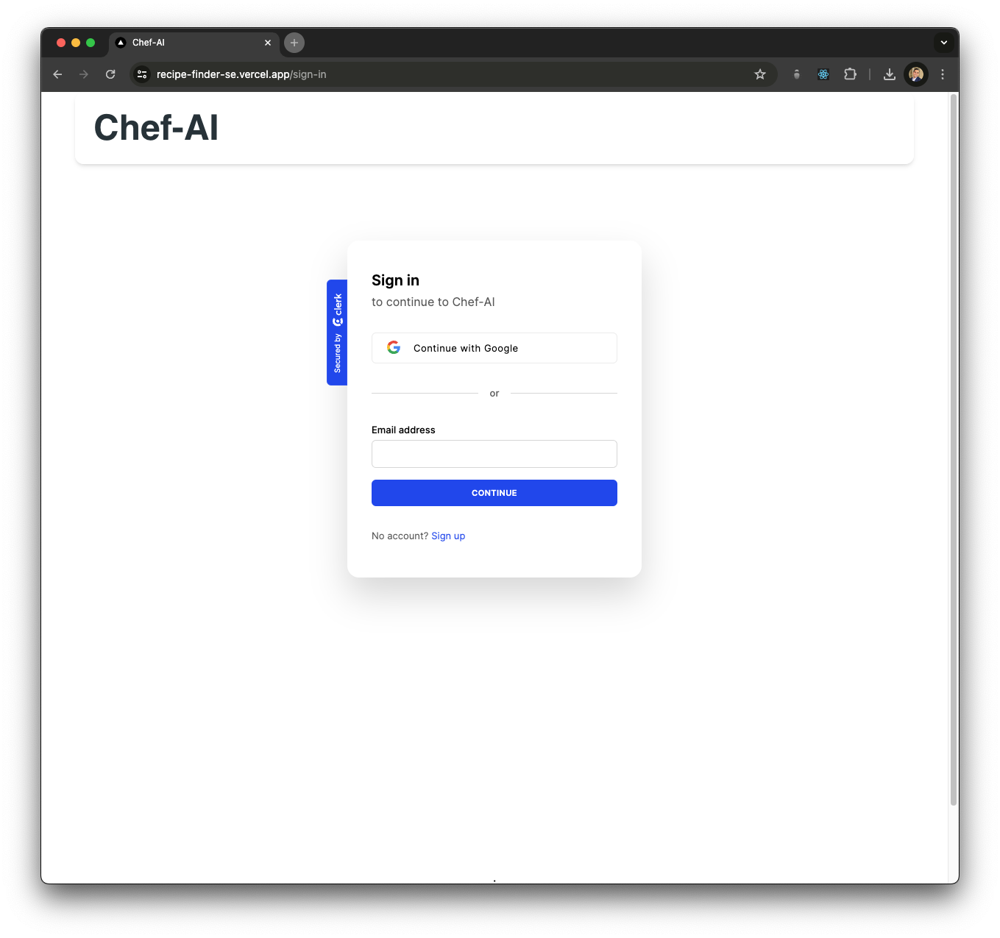
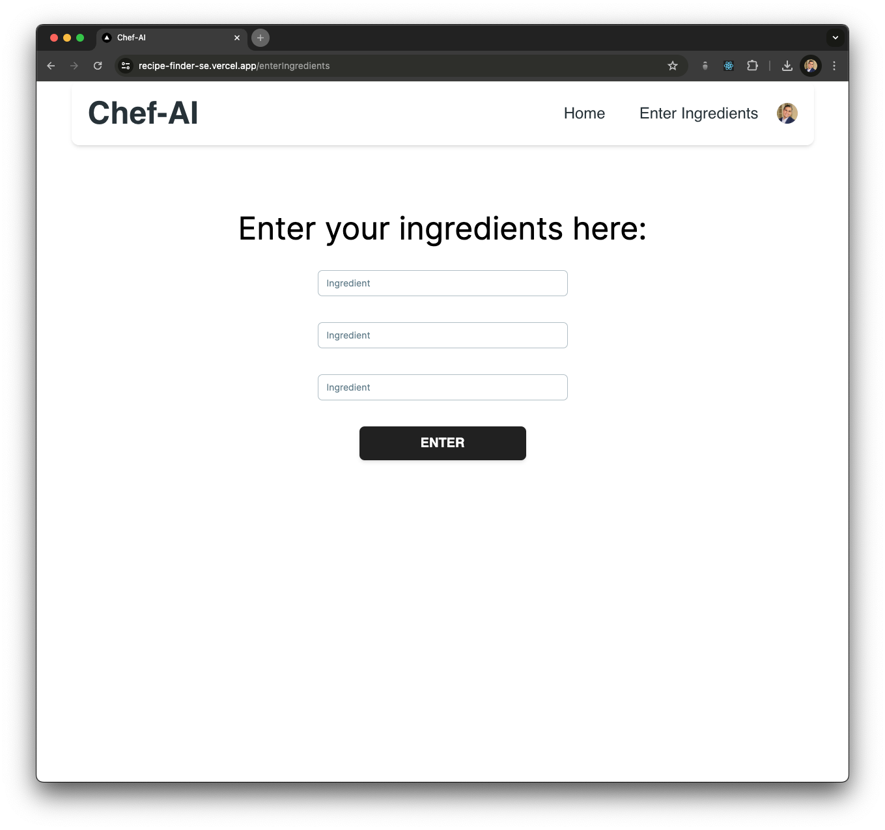
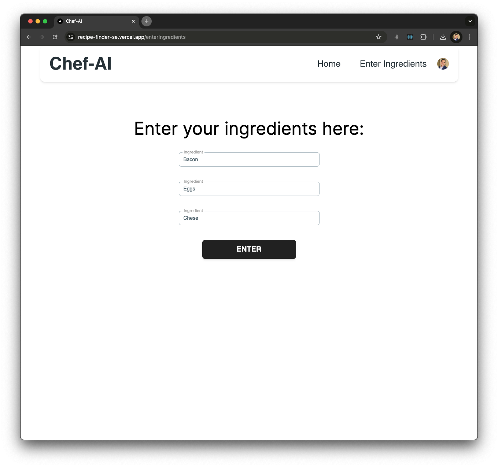
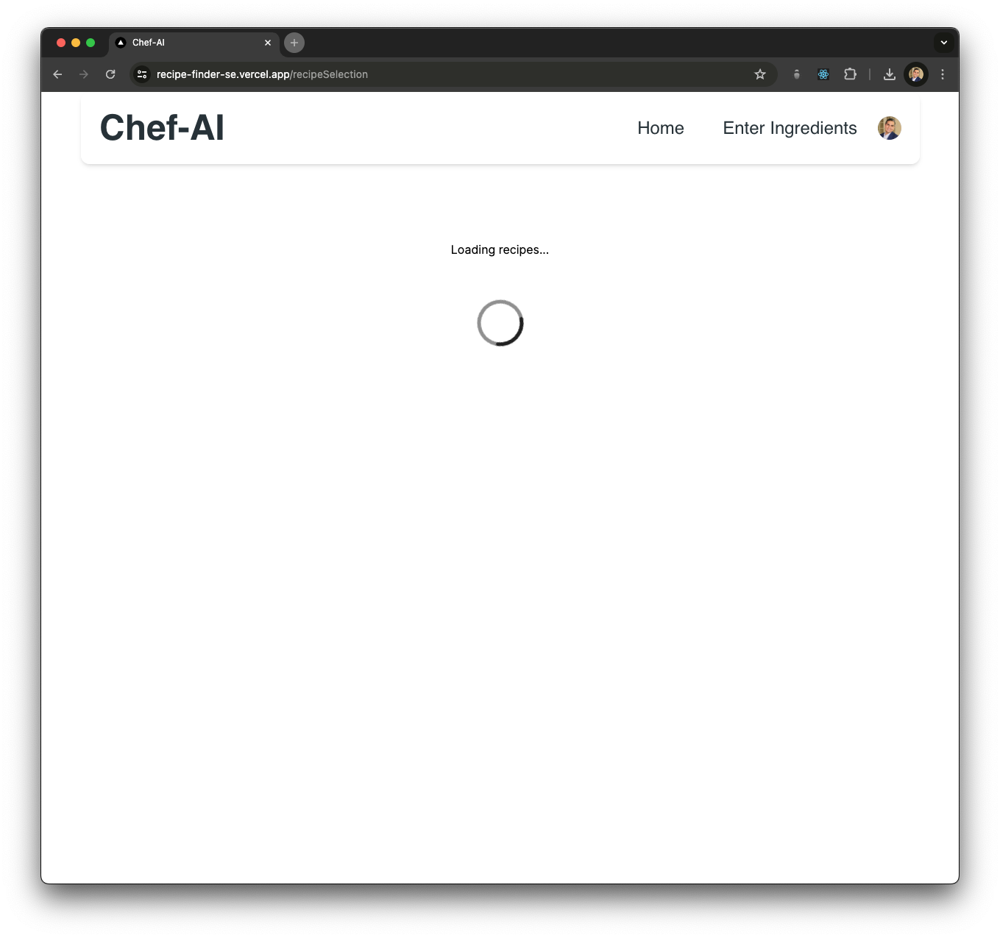
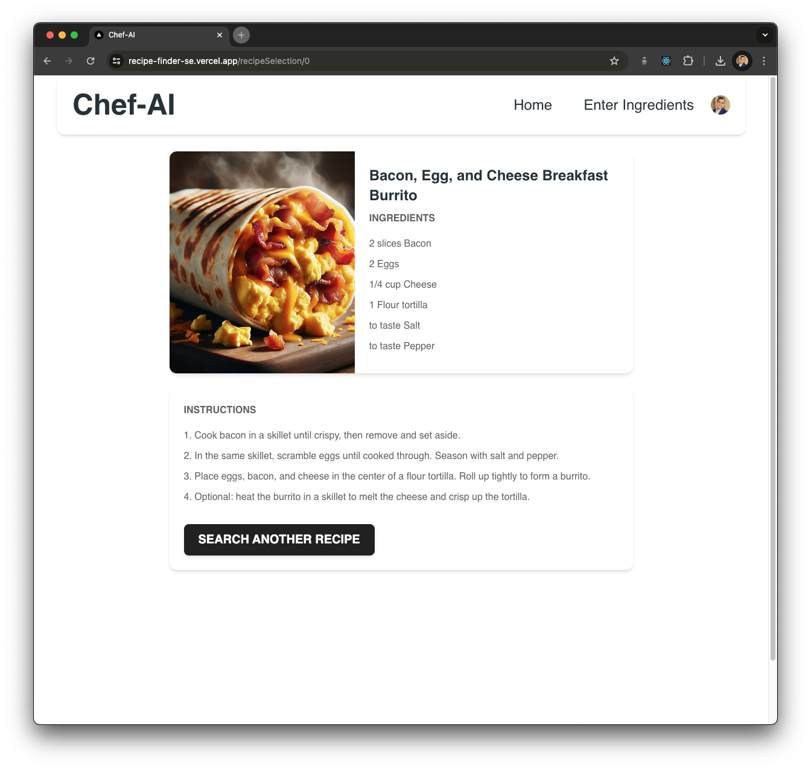

# Chef-AI

## Contributors

| Name           | Link to GitHub Account                     | Link to LinkedIn Account                 |
|----------------|--------------------------------------------|------------------------------------------|
| Guido Asbun    | [GitHub](https://github.com/guidoasbun)    | [Guido Asbun](https://www.linkedin.com/in/guidoasbun/) |
| William Bui    | [GitHub](https://github.com/wnbui)         | [William Bui](https://www.linkedin.com/in/wnbui/) |
| Adrian Vasquez | [GitHub](https://github.com/adriancancode) | [Adrian Vasquez](https://www.linkedin.com/in/adrian-vazquez-0630b22a2/) |

### Link to deployed website:
[Chef-AI](https://recipe-finder-se.vercel.app/)

### Link to GitHub Repository:
[GitHub Repository](https://github.com/guidoasbun/recipe-finder-se)

### Link to Documentation
[Documentation](src/assets/Documentation/Chef-AI-documentation.pdf)

### Description
This application uses the OpenAI API to provide users with recipes based on the ingredients they have at home. 
Assuming the user has the basic ingredients in their pantry, the application will provide an AI generated recipe after 
the user inputs 3 main ingredients they want to work with. 

This application also provides an OpenAI generated image of the recipe.

### Notable Technologies Used
- Next.js
- Tailwind CSS
- JavaScript
- OpenAI API
- Vercel
- CircleCI for CI/CD pipeline
- Authentication through Clerk.com 
  - SaaS for user authentication
- Proper Software Engineering Principles
  - Agile Development
  - Test Driven Development
  - Pair Programming
  - Code Reviews
  - Continuous Integration
  - Continuous Deployment

### How to run the application
1. Clone the repository
2. Run `npm install` to install the dependencies
3. Run `npm run dev` to start the development server
4. Open your browser and navigate to `http://localhost:3000/` or the port specified in the terminal
5. Enjoy the recipes!

### Application Screenshots

